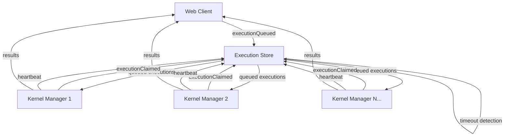

# Execution Queue System

This document explains the new robust execution queue system that replaced the previous ad-hoc cell execution approach.

## Overview

The execution queue system provides reliable, fault-tolerant code execution with proper kernel management, timeout handling, and graceful failover between multiple kernel instances.

### Key Benefits

- **No race conditions** between multiple kernels
- **Robust timeout handling** - executions can't get permanently stuck
- **Automatic failover** when kernels crash or become unresponsive
- **Real-time monitoring** and observability
- **Backward compatibility** with existing cell execution events

## Architecture



## Core Components

### 1. Execution Queue (`executions` table)

Each execution request creates an entry with:
- **Unique ID**: `exec-{cellId}-{executionCount}`
- **Status**: `queued` → `claimed` → `running` → `completed/failed/timeout`
- **Ownership**: Which kernel claimed the execution
- **Timing**: Created, claimed, started, completed timestamps
- **Timeout**: When execution should be considered stuck

### 2. Kernel Registry (`kernels` table)

Active kernels register themselves with:
- **Unique ID**: Auto-generated kernel identifier
- **Heartbeat**: Regular "I'm alive" signals
- **Capabilities**: Supported languages, features
- **Metadata**: Process info, platform details

### 3. KernelManager Class

Handles the complete kernel lifecycle:
- **Registration**: Announces kernel availability
- **Claiming**: Competes for queued executions
- **Execution**: Runs code with timeout monitoring
- **Heartbeat**: Proves kernel is still responsive
- **Cleanup**: Releases claimed work on shutdown

## Execution Flow

1. **Web Client** queues execution via `executionQueued` event
2. **Available kernels** see queued execution and compete to claim it
3. **First kernel** to claim gets exclusive ownership
4. **Kernel executes** code while sending progress updates
5. **On completion**, execution is marked appropriately
6. **If kernel dies**, other kernels detect and take over abandoned work

## Events

### Queue Management Events

- `executionQueued` - New execution request
- `executionClaimed` - Kernel takes ownership
- `executionProgress` - Kernel reports it's still working
- `executionTimeout` - Execution exceeded time limit
- `executionReleased` - Kernel releases claimed execution

### Kernel Management Events

- `kernelRegistered` - New kernel comes online
- `kernelHeartbeat` - Kernel proves it's alive
- `kernelShutdown` - Graceful kernel shutdown
- `kernelTimeout` - Kernel detected as dead

## Usage

### Starting the System

1. **Clean slate** (optional but recommended):
   ```bash
   pnpm clean-store
   ```

2. **Start sync backend**:
   ```bash
   pnpm dev:sync-only
   ```

3. **Start web client**:
   ```bash
   pnpm dev:web-only
   ```

4. **Start kernel(s)**:
   ```bash
   # Terminal 1
   NOTEBOOK_ID=my-notebook pnpm dev:kernel
   
   # Terminal 2 (optional - multiple kernels for load balancing)
   NOTEBOOK_ID=my-notebook pnpm dev:kernel
   ```

### Monitoring

**Real-time queue monitoring**:
```bash
pnpm monitor-queue
```

Shows:
- Active kernels and their health
- Queued, running, and completed executions
- System warnings (dead kernels, stuck executions)
- Performance metrics

### Cleanup

**Fix stuck executions** (when things go wrong):
```bash
pnpm cleanup-queue
```

Handles:
- Dead kernels that stopped sending heartbeats
- Stuck executions that exceeded timeouts
- Legacy cell states from old system

## Configuration

### Environment Variables

```bash
# Required
NOTEBOOK_ID=my-notebook              # Which notebook this kernel serves
AUTH_TOKEN=your-auth-token          # Sync backend authentication

# Optional
LIVESTORE_SYNC_URL=ws://localhost:8787  # Sync backend URL
REFRESH_INTERVAL=5000                   # Monitor refresh rate (ms)
```

### KernelManager Options

```typescript
const kernelManager = new KernelManager(store, {
  notebookId: "my-notebook",
  heartbeatInterval: 30_000,        // 30 seconds
  executionTimeout: 5 * 60 * 1000,  // 5 minutes
  claimBatchSize: 3,                // Max concurrent executions
});
```

## Fault Tolerance

### Kernel Crashes

- **Detection**: Missing heartbeats for >2 minutes
- **Recovery**: Other kernels automatically take over abandoned executions
- **Cleanup**: Dead kernel's claimed executions are released back to queue

### Stuck Executions

- **Detection**: Runtime exceeds configured timeout (default: 5 minutes)
- **Recovery**: Execution marked as timeout, kernel can claim new work
- **Prevention**: Progress updates reset the timeout timer

### Split Brain Prevention

- **Atomic claiming**: Only one kernel can claim each execution
- **Heartbeat enforcement**: Dead kernels can't claim new work
- **Timeout cascade**: Stuck kernels are detected and isolated

## Backward Compatibility

The system maintains compatibility with legacy `cellExecutionRequested` events:

1. Legacy events automatically create execution queue entries
2. Old cell state management still works
3. Both systems can run simultaneously during migration

## Troubleshooting

### Common Issues

**No kernels available**:
- Check kernel processes are running
- Verify `NOTEBOOK_ID` matches between client and kernel
- Check sync backend connectivity

**Executions stuck in "queued"**:
- Verify kernels are registered: `pnpm monitor-queue`
- Check for authentication issues in kernel logs
- Ensure sync backend is running

**Multiple executions of same cell**:
- Check for duplicate `executionQueued` events
- Verify execution deduplication logic
- Run cleanup: `pnpm cleanup-queue`

### Debug Commands

```bash
# Monitor system health
pnpm monitor-queue

# Clean stuck state
pnpm cleanup-queue

# Complete reset
pnpm clean-store

# View kernel logs
NOTEBOOK_ID=my-notebook pnpm dev:kernel
```

## Performance

### Scalability

- **Horizontal**: Multiple kernels can serve the same notebook
- **Load balancing**: Kernels automatically distribute work
- **Concurrency**: Each kernel can handle multiple executions (configurable)

### Monitoring Metrics

- Execution queue length
- Kernel response times
- Heartbeat intervals
- Timeout rates
- Claim success rates

## Future Enhancements

- [ ] Kernel affinity (prefer same kernel for related executions)
- [ ] Execution prioritization
- [ ] Resource-based scheduling (CPU/memory limits)
- [ ] Cross-notebook kernel sharing
- [ ] Execution result caching
- [ ] Performance analytics dashboard

## Migration from Legacy System

The new system runs alongside the old one during transition:

1. **Phase 1**: Deploy new system, legacy events create queue entries
2. **Phase 2**: Update clients to use `executionQueued` events directly  
3. **Phase 3**: Remove legacy `cellExecutionRequested` handling

No downtime required - the migration is seamless.